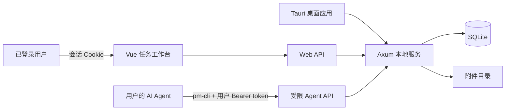

# Agents PM Tool

<p align="center">
  
</p>

Agents PM Tool 是一个面向人类与 AI Agent 协作的本地项目管理工具。桌面应用负责启动内嵌 Web 服务和管理运行设置；用户在浏览器中的任务表维护项目、任务与附件，Agent 则通过 `pm-cli` 查看任务与附件，并在授权范围内创建或修改任务。

数据默认保存在运行桌面服务的主机 SQLite 中，不依赖云服务或外部数据库。局域网模式内置本地用户、会话与细粒度授权。

## 主要功能

- **任务工作台**：提供项目、类型、描述、备注、状态、子任务 ID、父级任务 ID、提交人、负责人、附件和时间等固定字段，支持行内编辑与详情抽屉；新装用户的字段默认按“任务描述、项目、任务类型、优先级、当前状态、提交人、负责人、附件、创建时间、完成时间、备注、ID、子任务 ID、父级任务 ID”排布并全部默认展示（操作列固定在最右侧），已保存过列布局的用户不受影响。两个任务关系字段均可多选，单元格用英文逗号分隔 ID，并保持“子任务 ↔ 父级任务”的双向关系一致；在新建弹窗或详情抽屉的关系字段下拉列表中已有勾选内容时，可右键列表中的任务 ID 选择「定位任务」，在任务表中翻页并滚动到该任务（不在当前筛选结果中会给出提示）。子任务全部进入「已完成」或「验收通过」后，本任务才能切换到「进行中」。Agent 把任务从「未开始」推进到其它任意状态时会自动认领为负责人（默认显示在“提交人”右侧）；此后其它 Agent 不能修改该任务，网页端用户仍按自身权限修改，也可在详情抽屉中清除负责人。单击任务描述即可立即编辑，点击输入框外自动保存；列表底部可一键添加空白任务，顶部“+ 新建任务”仍提供完整新建弹窗，并会按浏览器记住上次在弹窗中选择的项目；备注列可像普通字段一样拖动排序和调整列宽，最右侧固定操作列可复制完整 Agent Prompt，ID 字段悬停按钮可复制一句话任务指引。侧栏顶部是“Agents PM Tool”模块：点击标题文字即可展开或收起项目列表（偏好随浏览器保存），标题右侧的加号用于新建项目，“Agents PM Tool”左侧的按钮可展开或收起整条侧栏。
- **高效浏览**：筛选采用“添加条件”的紧凑模式，打开空筛选时默认显示第一个字段，也可按需选择字段、运算方式和值；支持多条件筛选（状态可选择“包含”或“不包含”；提交人支持按「用户/Agent」大类或具体提交人筛选，含 `Agent（用户名）`）、关键词搜索、分页、排序、分组，以及手动拖拽排序。
- **批量处理**：可批量修改项目、类型、状态，或批量删除任务。
- **操作历史**：任务详情分为「详情 / 历史」两个分页。历史按时间倒序展示操作人、字段和变更前后值，记录网页及 Agent 的任务创建、编辑、批量修改、关联关系、自动回退、排序、附件增删，以及项目重命名和账号删除引起的任务变化；每次加载 50 条，可继续加载更早记录。历史随数据库持久保存，从升级启用后开始记录，旧操作不补造；普通用户只能看到有权访问的项目历史与关联任务。
- **撤销任务修改**：点击工作台顶部「撤销」，或按 **Ctrl+Z**（macOS 为 **⌘Z**），撤销当前页面、当前登录期间最近的字段编辑、批量修改、关联关系或手动排序，最多保留 100 步。输入框中仍使用原生文本撤销。服务端会复检账号权限、状态与子任务规则；相关字段已被其他操作修改时会提示冲突，不覆盖新值。撤销本身保留历史，完成时间继续遵循状态迁移规则。刷新页面、退出登录或成功执行新建/删除任务、附件增删会清空撤销栈；这些操作及项目管理、筛选/分组/视图设置不参与任务撤销。
- **视图偏好与关联图**：可调整列宽、列顺序与可见性；拖动字段调整顺序时，任务表用贯穿表格的竖线标出插入位置，字段设置列表也会显示插入线。行高偏好随浏览器保存；分组、排序和筛选按账号保存在服务端，浏览器和「进入应用」窗口打开时都能恢复（带参数的 URL 仍可分享）。任务表页签的展开列表可保存当前浏览器中的筛选方案；在任务表视图下单击页签开合该列表，从关联图切回任务表时只切换视图、不弹出列表。关联图页签同样带展开列表：在关联图视图下单击页签可按项目筛选显示的任务树——这就是任务表的项目筛选（侧栏当前项目），只是换了个入口，选中状态随筛选在两端同步，页签在恰好筛选一个项目时显示项目名；从任务表切过来时只切换视图。直接切换到关联图页签时，显示所有有父子关系且顶层父任务未「验收通过」的可见任务树，多棵树分行排布并自动调整初始缩放；没有父子关系的单个任务不显示。在任务行左侧“三点”菜单或右键菜单选择「展示关联图」时，只显示所点任务所在的一棵树，即使其顶层父任务已「验收通过」，并同步打开任务详情。图中直接子任务同列，下一层任务尽量对齐相连的卡片，圆角连线绕开任务卡片；节点用状态色框区分。单击或按 Enter 打开同一任务详情，点击画布空白处取消选中并关闭详情；左键拖动卡片可临时调整布局且连线实时跟随，中键拖动画布平移，滚轮缩放。画布首次打开时居中，卡片拖动不限制在初始坐标范围内。右上角刷新按钮会重新读取关联任务，并恢复自动布局、默认缩放与居中位置。
- **列布局**：任务描述可和其他字段一样调整顺序，但始终显示；工具栏「冻结」可设置左侧冻结的数据列数（0–7，默认 1），序号列始终固定在左侧，操作列固定在最右侧。冻结列会随字段顺序、显隐和列宽调整；窗口宽度不足时自动减少实际冻结列数，设置值不变。
- **项目管理**：通过侧栏项目右侧的“三点”维护名称、颜色、本地目录和 Git 地址，项目重命名会同步更新已有任务；侧栏加号用于新建项目，项目可直接拖拽调整顺序。
- **附件管理**：支持图片、视频和常用文档；任务表直接显示图片缩略图或文件类型图标，图片和视频可点击预览，在系统浏览器和“进入应用”窗口中均可将文件拖到对应附件单元格上传，也可选中附件单元格后直接粘贴剪贴板中的文件；新建任务和任务详情的附件框同样支持选择、拖拽或粘贴文件；任务详情中提供完整管理，单个文件最大 200 MB。
- **实时刷新**：任务变化通过 SSE 推送到网页，连接中断时自动使用轮询兜底。
- **完成提醒**：任务状态切换为「待验证」或「已完成」时（网页端、批量操作或 Agent 通过 pm-cli 推进都会触发），桌面应用会弹出系统通知，包含项目与任务摘要；仅状态真正跨入这两个状态时提醒一次，系统通知发送失败不影响任务状态本身。
- **多用户与权限**：支持注册、登录、管理员和多个超级管理员；普通用户按项目、字段及状态/类型选项授权。用户管理还可单独调整每个账号的 Agent 创建字段、修改字段、可设状态和描述修改范围；未配置时保持旧版 Agent 权限。实际 Agent 权限是两套授权的交集，均由服务端强制。
- **远程 Agent**：每个用户独立签发、吊销 Agent token；`pm-cli` 支持环境变量或用户配置连接局域网服务，可只读获取授权项目中的任务附件。skill 按前端目录安装：主机在面板上一键装，远程用户选目录直接写入，或把面板给出的那条命令复制到 Agent 所在电脑的终端跑一次。
- **本机服务设置**：可配置端口、仅本机或局域网访问、启动行为和关闭窗口后的服务行为；桌面设置页可手动启动/停止服务，并可分别复制当前本机地址和局域网地址。选择局域网访问后，还会在局域网地址下方显示本机的 Tailscale 地址（本机装了 Tailscale 且在线时才显示，供同一 Tailscale 网络中的设备访问；没装则只显示本机与局域网两条地址）。主机账号可从任务工作台侧栏打开与桌面端共用内容的“工作区设置”弹窗，相关接口同时校验主机身份与本机回环来源。任务工作区既可用系统浏览器打开（“打开网页”），也可在应用内以独立窗口打开（“进入应用”），并可从系统托盘重新打开应用；“进入应用”会隐藏设置窗口，应用内点击“工作区设置”则关闭工作台窗口并切回设置窗口。关闭设置窗口或应用内工作台时都会执行当前的“关闭窗口时”选项；保留服务时再次单击托盘图标（macOS 为菜单栏图标，或直接点击程序坞图标）会恢复关闭前所在的设置页或应用工作区，退出后重新启动也会恢复最后停留的界面。应用内窗口会记住关闭时的位置与大小（最大化、贴边半屏或四分之一也照原样还原），换过显示器则自动落回可见区域。
- **明暗主题**：桌面设置页和任务工作台均支持浅色、深色主题；主题全局共用一份（存于 settings.json），任一端切换另一端实时跟随，未设置时跟随系统偏好。「进入应用」窗口的原生顶栏也随之切换明暗，Windows 11 下窗口失焦时标题栏背景仍会同步更新。

## 工作方式



桌面应用默认监听 `127.0.0.1:17890`。如果端口被占用，服务会在后续端口中自动选择可用端口；实际地址会显示在设置窗口中。

## 快速开始

### 使用安装版

1. 安装并启动 **Agents PM Tool**。
2. 在设置窗口确认服务已运行（也可用“启动服务/停止服务”手动控制）：点“打开网页”用系统浏览器访问，或点“进入应用”在应用内直接打开同一套任务工作区界面。
3. 浏览器访问时选择“以主机账号进入”。内置主机账号固定拥有超级管理员权限；也可以注册命名账号测试授权。
4. 首次启动会创建 `default-project`。管理员可以创建项目，并在“用户管理”中给局域网用户授权。
5. 关闭设置窗口或应用内工作台后，程序会执行当前的“关闭窗口时”选项：保留服务时继续驻留系统托盘（macOS 菜单栏），再次单击托盘图标（macOS 也可点击程序坞图标）会恢复关闭前的界面；退出应用时同时停止服务。需要手动彻底退出时，也可从托盘菜单选择“退出（停止服务）”。

### 从源码启动

开发环境需要：

- Windows 10/11（含 WebView2）或 macOS 11+；
- Node.js 20+；
- Rust stable（Windows 用 MSVC 工具链，macOS 需 Xcode 命令行工具）；
- Python 3（用于项目提供的启动与正式打包脚本）。

安装依赖并启动开发模式：

```powershell
npm ci
python dev.py
```

`dev.py` 会检查环境、构建供内嵌服务使用的前端资源，然后启动 Tauri 开发模式。开发数据保存在项目根目录的 `data/` 中。

也可以手动执行：

```powershell
npm run build
npm run tauri dev
```

只启动无桌面窗口的服务，便于接口或 CLI 联调：

```powershell
npm run build
cargo run --manifest-path src-tauri/Cargo.toml --example serve
```

## Agent CLI

`pm-cli` 是 Agent 使用的 HTTP 客户端，实现是 skill 目录里的一个 Node 脚本（`bin/pm-cli.mjs`，零第三方依赖，Windows / macOS / Linux 通用，需要 **Node.js 18 或更高版本**）。它不会直接访问 SQLite，而是调用服务端的受限 API。

**它不在系统 PATH 上**，调用前先定位到 skill 目录：脚本在 `<前端 skills 根目录>/pm-cli/bin/` 下，可以直接运行同目录的 `pm-cli.cmd`（Windows）或 `pm-cli`（macOS / Linux），也可以写成 `node "<skill>/bin/pm-cli.mjs" <命令>`。`pm-cli --help` 会打印出当前脚本的实际路径。

### 安装位置

在主机的「我的 Agent 访问」面板上，两种装法效果相同：点前端卡片上的按钮一键安装，或把面板上那条命令复制到终端执行一次（装到检测到的全部前端）。本机命令不带连接参数——应用会把端口与 token 写在你电脑上固定的位置由 `pm-cli` 自动读取，写进配置文件反而会盖住本机自动发现。远程用户在面板里选目标目录直接写入，或把那条命令复制到 Agent 所在电脑的终端执行——它会装到检测到的全部前端，并把服务地址与 token 一并写好。各前端的 skills 根目录：

| 前端 | Windows | macOS |
| --- | --- | --- |
| Codex | `%USERPROFILE%\.agents\skills`（旧版 `~/.codex/skills`） | `~/.agents/skills`（旧版 `~/.codex/skills`） |
| Claude Code | `%USERPROFILE%\.claude\skills` | `~/.claude/skills` |
| WorkBuddy | `%USERPROFILE%\.workbuddy\skills` | `~/.workbuddy/skills` |
| OpenCode | `%USERPROFILE%\.config\opencode\skills` | `~/.config/opencode/skills` |
| Cursor | `%USERPROFILE%\.cursor\skills` | `~/.cursor/skills` |
| Pi | `%USERPROFILE%\.pi\agent\skills` | `~/.pi/agent/skills` |
| DeepSeek Harness | `%USERPROFILE%\.dsh\skills` | `~/.dsh/skills` |

DeepSeek Harness 设置了 `DSH_HOME` 时改用 `$DSH_HOME/skills`。判断某前端是否装在本机只要求它的配置目录存在，skill 目录会在安装时按需创建，因此刚装好、还没放过任何 skill 的前端也能直接安装。装好后重新打开终端或 Agent 前端，让它重新加载 skill。

### 连接

**Agent 跑在装了 Agents PM Tool 的那台电脑上**：不需要任何配置。应用会把当前端口与主机 token 写到你电脑上固定的用户级位置，`pm-cli` 自动读取（这就是本机零配置能连上的原因，skill 装在哪里都无所谓）。主机 token 固定不变，应用重启不会失效，只有在设置窗口或「我的 Agent 访问」面板手动重新生成时才会更换。

**远程 Agent** 在那台电脑上配置一次：

```powershell
pm-cli config set server-url http://192.168.1.10:17890
pm-cli config set token <我的AgentToken>
pm-cli config show
```

服务地址直接抄「我的 Agent 访问」面板上显示的那个即可：面板按**你当前的访问方式**给出地址——从局域网打开就给局域网地址，从 Tailscale 打开就给 Tailscale 地址，经域名或隧道（ngrok、Cloudflare Tunnel 等）打开就给那个域名并带上 `https`。所以并不需要自己判断该填哪个，换一种方式打开本页就是另一个。若 Agent 不在浏览页面那台机器上，可以在设置的「远程 Agent 服务地址」里显式指定一个，填了就以它为准；留空即按上面的规则自动识别。

配置保存在用户级配置文件里：Windows 是 `%APPDATA%\agents-pm-tool\cli.json`，macOS 是 `~/Library/Application Support/agents-pm-tool/cli.json`。临时环境变量 `PM_SERVER_URL` 与 `PM_AGENT_TOKEN` 优先级更高，适合 CI 或不希望落盘的场景；两者必须成对设置——只设其中一个（或其一为空）会直接报错，不会回落到用户配置，需补齐另一个或清掉已设的那个（Windows：`Remove-Item Env:PM_SERVER_URL`，macOS / Linux：`unset PM_SERVER_URL`）。

优先级是「环境变量 > 用户配置 > 本机应用写出的运行信息」：手工配置过一次之后，这份配置会一直优先于本机自动发现。如果应用换了端口而旧配置还指向老端口，`pm-cli doctor` 会明确点出这个不一致并给出修正命令。

常用命令：

```powershell
# 查看项目
pm-cli projects
pm-cli permissions --json  # 当前 token 对各项目可创建/修改的字段与枚举值

# 创建任务：项目、类型、描述均为必填项
pm-cli create --project default-project --type BUG --description "修复任务列表白屏"
pm-cli create --project default-project --type 优化 --description "实现新功能" --predecessor-task-ids "子任务ID1,子任务ID2"

# 查看与筛选任务
pm-cli list --status 进行中
pm-cli list --project default-project --keyword "列表" --json
pm-cli get <任务ID> --json

# 查看任务附件，并下载到指定文件（省略 --output 时使用原文件名）
pm-cli attachments <任务ID> --json
pm-cli download <附件ID> --output <文件路径>

# 修改字段；默认权限仍仅开放状态、优先级与自己 Agent 创建任务的描述
pm-cli status <任务ID> --to 待验证
pm-cli describe <任务ID> --description "已修复并补充测试"
pm-cli update <任务ID> --note "已复查" --status 进行中
```

**连接排障**：运行 `pm-cli doctor`（加 `--json` 便于 Agent 解析）。它会报告实际生效的连接来源（环境变量 / 用户配置 / 本机应用写出的运行信息）、脱敏后的 token、连通性与可见项目数、脚本路径与 Node 版本，并给出下一步命令。退出码与其它命令一致：`0` 正常，`2` 参数或鉴权失败，`3` 未配置或连不上。

**token 等同身份**：pm-cli 完全以 token 所属账号的身份操作，权限也按该账号的授权。不要转给他人使用；重新生成 token 会让旧 token 立即失效。

从源码运行时，可以直接跑仓库里的脚本：

```powershell
node pm-cli-skill/bin/pm-cli.mjs projects
```

所有子命令均可通过 `--json` 输出结构化结果。完整帮助可通过 `pm-cli --help` 或 `pm-cli <子命令> --help` 查看。

`GET /api/agent/help` **无需 token**，返回接口自述与 `bootstrap` 接入步骤（要让用户做什么、拿到 token 后执行什么命令、没有 pm-cli 时怎么办），供尚未安装 pm-cli 与 skill 的 Agent 自助定位。`GET /api/agent/skill/payload`（文件清单）与 `GET /api/agent/skill/install.mjs`（自包含安装脚本）同样免 token——skill 内容不含机密，而「还没有 skill 的机器」本身就需要先拿到它。其余 `/api/agent/*` 接口仍需 Bearer token。

### 权限边界

| 操作 | 管理员网页端 | 普通用户网页端 | Agent CLI |
| --- | :---: | :---: | :---: |
| 查看和筛选任务 | 全部项目 | 已授权项目 | 已授权项目 |
| 创建任务 | ✓ | 需项目与创建字段权限 | 还需 Agent 创建权限；项目/类型/描述必填，额外字段逐项授权 |
| 修改状态 | 七种状态 | 需状态字段及具体选项权限 | Agent 可设状态 ∩ 用户状态选项权限（默认三种） |
| 修改描述或备注 | ✓ | 需对应字段权限 | 需 Agent 对应字段权限；描述默认仅限自己 Agent 创建的任务 |
| 修改子任务/父级任务 | ✓ | 需对应字段权限 | 需 Agent 对应字段权限，且关联任务须可见 |
| 修改项目或任务类型 | ✓ | 需字段及目标值权限 | 需 Agent 对应字段权限及网页端授权 |
| 管理项目 | ✓ | — | 只读已授权项目 |
| 查看、下载附件 | ✓ | 已授权项目 | 已授权项目中的附件（只读） |
| 上传、删除附件或删除、排序任务 | ✓ | 需对应权限 | — |
| 改派或清除任务负责人 | ✓ | 需负责人字段权限 | — |
| 修改 ID、提交人或系统时间 | — | — | — |

这些限制由 Rust 服务端强制执行，而不是只依赖界面或 CLI 参数检查。管理员可管理普通用户的 Agent 权限，超级管理员还可管理管理员及主机账号的 Agent 权限；固定 `id=host` 的主机账号只允许本机回环地址免密登录，并且不能被停用、删除或降级。Agent 默认不能设验收状态或“取消”，仅在管理员显式授予对应状态值且账号字段授权也允许时才能设置。任务删除、附件上传/删除及项目管理始终不向 Agent 开放。

## 任务规则

- 任务类型固定为：`新增需求`、`优化`、`BUG`。
- 状态固定为：`未开始`、`进行中`、`待验证`、`已完成`、`验收未通过`、`验收通过`、`取消`。Agent 默认不能设置`取消`，管理员可显式授权；取消状态不刷新也不清空完成时间。
- 子任务与父级任务是同一关系的两个方向：`predecessor_task_ids` 是本任务的子任务 ID，`unlock_task_ids` 是本任务的父级任务 ID。禁止自依赖和循环依赖；删除任务时相关关系自动清理。父级从`未开始`或`取消`启动为`进行中`时，子任务须全部处于`已完成`或`验收通过`；父级进入`待验证`、`已完成`或`验收通过`时，子任务须全部处于`待验证`、`已完成`或`验收通过`。子任务回到其它状态，或新增子任务时，处于这三个状态的父级及各级上级任务会自动回到`进行中`。
- 网页创建的任务提交来源固定为“用户”，CLI 创建的任务提交来源固定为“Agent”，创建后不可修改；界面显示实际用户名，Agent 任务显示为 `Agent（用户名）`。升级时未记录账号的历史任务归属主机，账号删除后无法追溯的任务显示“未知用户”。
- 负责人默认空；Agent 把任务状态从「未开始」推进到其它任意状态时自动成为负责人，显示为 `Agent（用户名）`。已有负责人的任务只能由该负责人（同一账号的 Agent）通过 Agent API 修改，其它 Agent 的修改会被拒绝（HTTP 403）；网页端用户不受此限制，可按授权继续修改、改派或清除负责人。负责人账号被删除后自动清空，任务重新对所有 Agent 开放。
- 任务 ID、创建时间由服务端生成。任务每次进入“待验证”“已完成”或“验收通过”时，完成时间都会更新为本次时间。
- 附件允许 `png`、`jpg`、`jpeg`、`gif`、`webp`、`mp4`、`mov`、`doc`、`docx`、`ppt`、`pptx`、`md`、`txt`、`pdf`、`xlsx`，单文件最大 200 MB。

## 数据与安全

运行数据位于：

- 开发模式：`<项目根目录>/data/`
- 发布版本（Windows）：`<主程序所在目录>/data/`
- 发布版本（macOS）：`~/Library/Application Support/agents-pm-tool/data/`（可执行文件在 .app 包内，包目录签名后只读，数据落在用户目录）

目录内容包括：

| 路径 | 用途 |
| --- | --- |
| `pm.db` | 用户、会话、授权、项目、任务与附件元数据 |
| `attachments/` | 上传的附件文件 |
| `settings.json` | 服务端口、访问范围和关闭行为等设置 |
| `runtime.json` | 当前服务端口、进程 ID 和本机主机 Agent token（同时在用户级配置目录留一份给 pm-cli 自动发现） |

备份时建议先彻底退出应用，再复制整个 `data/` 目录。旧版单用户数据库会自动升级：创建固定主机账号，并把原全局 Agent 接入迁移为主机账号 token，本机 `pm-cli` 使用方式不变。不要提交或分享 `runtime.json`、远程用户 token 或 CLI 配置文件；泄露后应立即在对应用户的 Agent 访问面板重新生成或吊销 token。

默认的“仅本机”模式只监听回环地址。切换到“局域网”后，其他设备必须注册并登录，且默认没有项目权限，需要管理员授权后才能查看或修改数据。当前方案面向可信局域网，不提供互联网级 HTTPS、防爆破或外部身份认证，请勿直接暴露到公网，也不要复用重要密码。

如果确实要用隧道或反向代理（ngrok、Cloudflare Tunnel、Tailscale Funnel 等）让外地设备访问，请注意三点。其一，**主机登录、工作区设置、本机 skill 安装这类“只允许主机在本机做”的操作会被拒绝**：这类代理进程就装在本机，转发过来的连接同样来自回环，所以服务端除了看来源地址，还会校验 `Host` 是否为回环写法、请求是否带转发头（本机直连两者都不满足，代理一定会带上）。这些操作请在装应用的那台机器上用 `http://127.0.0.1:<端口>` 完成。其二，**隧道地址本身要当敏感信息**：它对外就是工作区的入口，泄漏出去别人就能注册账号、尝试登录，所以别写进公开文档或截图。其三，**免费隧道会给“像浏览器”的请求插一张提示页**：ngrok 免费域名对带浏览器 User-Agent 的请求返回 HTML 警告页，而 PowerShell 的 `irm` 正好带这种 UA，于是安装脚本命令会拿回 HTML、node 报 `Unexpected identifier 'are'`。面板上复制的命令会自动带上 `-Headers @{"ngrok-skip-browser-warning"="1"}` 跳过它；手工拼命令、或换成其他隧道时，记住这一条即可（用 `curl` 也天然规避，它的 UA 不是浏览器）。

`data/` 的物理安全等同于系统最高权限：拿到完整数据目录的人可以把它复制到自己的机器，并通过那台机器的 loopback 主机登录获得超级管理员权限。因此备份也应按敏感数据保管。

## 开发命令

```powershell
npm run dev                       # 仅启动 Vite 前端开发服务器
npm run build                     # 类型检查并构建前端
npm test                          # 运行 Vitest 测试（含 pm-cli 与安装脚本的行为测试）
cargo test --manifest-path src-tauri/Cargo.toml
```

正式打包使用（Windows 与 macOS 均可）：

```powershell
python build.py
```

macOS 日常自用打包也可以直接双击运行 `build.command`（不推进版本号、不写发布记录，产出在 `src-tauri/target/release/bundle/dmg/`）。

脚本会在打包前询问版本：直接回车沿用 `version.json` 的当前版本，输入更高版本号则先校验 `major.minor.patch` 格式（修订号限 0–9），无效时要求重新输入。随后同步项目版本并构建当前平台的安装包（Windows 为 NSIS，macOS 为 DMG）；尚未发布的版本构建成功后自动记录发布并归档，重复构建已发布版本不新增记录。成功或失败都会显示结果并等待回车后退出。安装包位于 `src-tauri/target/release/bundle/<nsis|dmg>/`，归档位于 `src-tauri/release-bundle/<nsis|dmg>/`。macOS 构建默认按当前机器架构产出（Apple Silicon 为 aarch64），未签名的 DMG 首次打开需在「系统设置 → 隐私与安全性」中放行。

Windows 已安装 NSIS 旧版时，升级安装默认选择“覆盖安装（推荐）”；只有手动选择“安装前卸载”才会先启动卸载器。更早的 WiX 安装方式仍需先卸载旧版。

`build.py` 和 `dev.py` 都会核对 `package.json` 与 `package-lock.json` 的内容指纹，**依赖清单变过就自动重装**（优先 `npm ci`），不需要你记着手动跑 `npm ci`。所以换机器、拉取到新增依赖的提交后，直接运行脚本即可。

## 技术栈

- **桌面端**：Tauri 2
- **前端**：Vue 3、TypeScript、Vite、Pinia
- **服务端**：Rust、Axum、Tokio
- **数据存储**：SQLite（rusqlite）
- **CLI**：Clap、Reqwest
- **测试**：Vitest、Cargo Test

## 项目结构

```text
agents-pm-tool/
├─ src/
│  ├─ grid-app/          # 浏览器任务工作台
│  ├─ config-app/        # Tauri 设置窗口
│  └─ shared/            # 共享类型、主题与基础组件
├─ src-tauri/
│  ├─ src/server/        # Axum 路由、鉴权、SSE 与静态资源服务
│  ├─ src/db/            # SQLite Schema、迁移和查询
│  └─ src/domain/        # 任务、ID 与附件规则
├─ tests/                # 前端与 pm-cli 单元测试
├─ pm-cli-skill/         # Agent skill 载荷：SKILL.md、bin/ 下的 pm-cli 脚本、安装脚本
├─ docs/                 # 开发规划、验收与评审记录
├─ scripts/              # 前端构建脚本
├─ dev.py                # 开发环境检查与启动入口
├─ build.py              # 正式打包脚本（Windows NSIS / macOS DMG）
└─ build.command         # macOS 双击打包（自用，不推进版本号）
```

更完整的设计背景与阶段记录参见 [`docs/development-plan.md`](docs/development-plan.md)。
