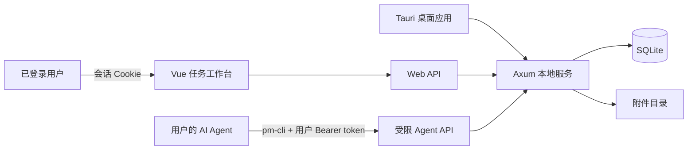

# Agents PM Tool

<p align="center">
  
</p>

Agents PM Tool 是一个面向人类与 AI Agent 协作的本地项目管理工具。桌面应用负责启动内嵌 Web 服务和管理运行设置；用户在浏览器中的任务表维护项目、任务与附件，Agent 则通过权限受限的 `pm-cli` 查看、创建和推进任务。

数据默认保存在本机 SQLite 中，不依赖云服务或外部数据库。局域网模式内置本地用户、会话与细粒度授权。

## 主要功能

- **任务工作台**：提供项目、类型、描述、备注、状态、提交人、附件和时间等固定字段，支持行内编辑与详情抽屉；备注列可像普通字段一样拖动排序和调整列宽，最右侧固定操作列可复制完整 Agent Prompt，ID 字段悬停按钮可复制一句话任务指引。
- **高效浏览**：支持多条件筛选、关键词搜索、分页、排序、分组，以及手动拖拽排序。
- **批量处理**：可批量修改项目、类型、状态，或批量删除任务。
- **视图偏好**：可调整列宽、列顺序与可见性，行高偏好随浏览器保存；筛选、排序和分组状态在浏览器中持久化（关闭网页后重开自动恢复，带参数的 URL 仍可分享），也可保存为当前浏览器中的筛选方案。
- **项目管理**：维护项目名称、颜色、本地目录和 Git 地址；项目重命名会同步更新已有任务。
- **附件管理**：支持图片、视频和常用文档；任务表直接显示图片缩略图或文件类型图标，图片和视频可点击预览，也可将文件拖到对应附件单元格上传；任务详情中提供完整管理，单个文件最大 200 MB。
- **实时刷新**：任务变化通过 SSE 推送到网页，连接中断时自动使用轮询兜底。
- **多用户与权限**：支持注册、登录、管理员和多个超级管理员；普通用户按项目、字段及状态/类型选项授权，所有边界由服务端强制。
- **远程 Agent**：每个用户独立签发、吊销 Agent token；`pm-cli` 支持环境变量或用户配置连接局域网服务，并可下载配套的 pm-cli-skill。
- **桌面服务设置**：可配置端口、仅本机或局域网访问、启动行为和关闭窗口后的服务行为，并可从系统托盘重新打开应用。
- **明暗主题**：桌面设置页和任务工作台均支持浅色、深色主题。

## 工作方式



桌面应用默认监听 `127.0.0.1:17890`。如果端口被占用，服务会在后续端口中自动选择可用端口；实际地址会显示在设置窗口中。

## 快速开始

### 使用安装版

1. 安装并启动 **Agents PM Tool**。
2. 在设置窗口确认服务已运行，点击“打开任务表”。
3. 本机浏览器选择“以主机账号进入”。内置主机账号固定拥有超级管理员权限；也可以注册命名账号测试授权。
4. 首次启动会创建 `default-project`。管理员可以创建项目，并在“用户管理”中给局域网用户授权。
5. 关闭设置窗口后，应用可按设置继续在系统托盘中运行；需要彻底停止服务时，从托盘菜单选择“退出（停止服务）”。

### 从源码启动

开发环境需要：

- Windows 10/11 与 WebView2；
- Node.js 20+；
- Rust stable（Windows MSVC 工具链）；
- Python 3（用于项目提供的启动与正式打包脚本）。

安装依赖并启动开发模式：

```powershell
npm ci
python dev.py
```

`dev.py` 会检查环境、构建供内嵌服务使用的前端资源，然后启动 Tauri 开发模式。开发数据保存在项目根目录的 `data/` 中。

也可以手动执行：

```powershell
npm run build
npm run tauri dev
```

只启动无桌面窗口的服务，便于接口或 CLI 联调：

```powershell
npm run build
cargo run --manifest-path src-tauri/Cargo.toml --example serve
```

## Agent CLI

`pm-cli` 是 Agent 使用的 HTTP 客户端。它不会直接访问 SQLite，而是调用服务端的受限 API。本机默认从主程序生成的 `data/runtime.json` 读取当前端口和主机 token；远程用户使用自己在“我的 Agent 访问”中签发的 token。

安装版会将 `pm-cli.exe` 随主程序安装，并把安装目录加入当前用户的 `PATH`。安装或升级后需重新打开终端或 Agent 前端，之后可在任意目录直接执行 `pm-cli`；卸载时会移除由安装器添加的 PATH 项。

常用命令：

```powershell
# 查看项目
pm-cli projects

# 创建任务：项目、类型、描述均为必填项
pm-cli create --project default-project --type BUG --description "修复任务列表白屏"

# 查看与筛选任务
pm-cli list --status 进行中
pm-cli list --project default-project --keyword "列表" --json
pm-cli get <任务ID> --json

# 推进状态，或修改 Agent 自己创建的任务描述
pm-cli status <任务ID> --to 待验证
pm-cli describe <任务ID> --description "已修复并补充测试"
```

远程 Agent 可在用户自己的电脑上配置一次服务地址和 token：

```powershell
pm-cli config set server-url http://192.168.1.10:17890
pm-cli config set token <我的AgentToken>
pm-cli config show
```

配置保存在 `%APPDATA%\agents-pm-tool\cli.json`。临时环境变量 `PM_SERVER_URL` 与 `PM_AGENT_TOKEN` 的优先级更高，适合 CI 或不希望落盘的场景；两者必须成对设置。网页的“我的 Agent 访问”面板会给出当前用户可直接复制的配置，并提供 pm-cli-skill 下载。本机还可将 skill 一键安装到已存在的 Codex、旧版 Codex 或 Claude Code skill 目录。

从源码运行 CLI 时，在命令前使用：

```powershell
cargo run --manifest-path src-tauri/Cargo.toml --bin pm-cli -- projects
```

所有子命令均可通过 `--json` 输出结构化结果。完整帮助可通过 `pm-cli --help` 或 `pm-cli <子命令> --help` 查看。

### 权限边界

| 操作 | 管理员网页端 | 普通用户网页端 | Agent CLI |
| --- | :---: | :---: | :---: |
| 查看和筛选任务 | 全部项目 | 已授权项目 | 用户权限 ∩ Agent 固有限制 |
| 创建任务 | ✓ | 需项目与创建字段权限 | 同左，且项目/类型/描述必填 |
| 修改状态 | 七种状态 | 需状态字段及具体选项权限 | 仅 `进行中`、`待验证`、`已完成` |
| 修改描述或备注 | ✓ | 需对应字段权限 | 仅修改当前用户的 Agent 创建任务描述 |
| 修改项目或任务类型 | ✓ | 需字段及目标值权限 | — |
| 管理项目 | ✓ | — | 只读已授权项目 |
| 管理附件、删除或排序任务 | ✓ | 需对应权限 | — |
| 修改 ID、提交人或系统时间 | — | — | — |

这些限制由 Rust 服务端强制执行，而不是只依赖界面或 CLI 参数检查。管理员可管理普通用户，超级管理员可管理角色和其他非主机账号；固定 `id=host` 的主机账号只允许本机回环地址免密登录，并且不能被停用、删除或降级。验收相关状态保留给网页端用户，Agent 不能自行将任务标记为“验收通过”“验收未通过”或“取消”。

## 任务规则

- 任务类型固定为：`新增需求`、`优化`、`BUG`。
- 状态固定为：`未开始`、`进行中`、`待验证`、`已完成`、`验收未通过`、`验收通过`、`取消`。其中`取消`只能由网页端设置，不刷新也不清空完成时间。
- 网页创建的任务提交人为“用户”，CLI 创建的任务提交人为“Agent”，创建后不可修改。
- 任务 ID、创建时间由服务端生成。任务每次进入“待验证”“已完成”或“验收通过”时，完成时间都会更新为本次时间。
- 附件允许 `png`、`jpg`、`jpeg`、`gif`、`webp`、`mp4`、`mov`、`doc`、`docx`、`ppt`、`pptx`、`md`、`txt`、`pdf`、`xlsx`，单文件最大 200 MB。

## 数据与安全

运行数据位于：

- 开发模式：`<项目根目录>/data/`
- 发布版本：`<主程序所在目录>/data/`

目录内容包括：

| 路径 | 用途 |
| --- | --- |
| `pm.db` | 用户、会话、授权、项目、任务与附件元数据 |
| `attachments/` | 上传的附件文件 |
| `settings.json` | 服务端口、访问范围和关闭行为等设置 |
| `runtime.json` | 当前服务端口、进程 ID 和本机主机 Agent token |

备份时建议先彻底退出应用，再复制整个 `data/` 目录。旧版单用户数据库会自动升级：创建固定主机账号，并把原全局 Agent 接入迁移为主机账号 token，本机 `pm-cli` 使用方式不变。不要提交或分享 `runtime.json`、远程用户 token 或 CLI 配置文件；泄露后应立即在对应用户的 Agent 访问面板重新生成或吊销 token。

默认的“仅本机”模式只监听回环地址。切换到“局域网”后，其他设备必须注册并登录，且默认没有项目权限，需要管理员授权后才能查看或修改数据。当前方案面向可信局域网，不提供互联网级 HTTPS、防爆破或外部身份认证，请勿直接暴露到公网，也不要复用重要密码。

`data/` 的物理安全等同于系统最高权限：拿到完整数据目录的人可以把它复制到自己的机器，并通过那台机器的 loopback 主机登录获得超级管理员权限。因此备份也应按敏感数据保管。

## 开发命令

```powershell
npm run dev                       # 仅启动 Vite 前端开发服务器
npm run build                     # 类型检查并构建前端
npm run build:cli                 # 构建 pm-cli sidecar 与 pm-cli-skill.zip
npm run build:all                 # 构建前端和 pm-cli
npm test                          # 运行 Vitest 测试
cargo test --manifest-path src-tauri/Cargo.toml
```

Windows 正式打包使用：

```powershell
python build.py
```

该脚本会同步项目版本、构建 NSIS 安装包，并在人工确认测试通过后记录发布。安装包位于 `src-tauri/target/release/bundle/nsis/`，确认发布后的归档位于 `src-tauri/release-bundle/nsis/`。

## 技术栈

- **桌面端**：Tauri 2
- **前端**：Vue 3、TypeScript、Vite、Pinia
- **服务端**：Rust、Axum、Tokio
- **数据存储**：SQLite（rusqlite）
- **CLI**：Clap、Reqwest
- **测试**：Vitest、Cargo Test

## 项目结构

```text
agents-pm-tool/
├─ src/
│  ├─ grid-app/          # 浏览器任务工作台
│  ├─ config-app/        # Tauri 设置窗口
│  └─ shared/            # 共享类型、主题与基础组件
├─ src-tauri/
│  ├─ src/server/        # Axum 路由、鉴权、SSE 与静态资源服务
│  ├─ src/db/            # SQLite Schema、迁移和查询
│  ├─ src/domain/        # 任务、ID 与附件规则
│  └─ src/cli/           # pm-cli
├─ tests/                # 前端单元测试
├─ pm-cli-skill/         # Agent skill 文档；构建时与 pm-cli 一起打包
├─ docs/                 # 开发规划、验收与评审记录
├─ scripts/              # 前端与 CLI 构建脚本
├─ dev.py                # 开发环境检查与启动入口
└─ build.py              # Windows 正式打包脚本
```

更完整的设计背景与阶段记录参见 [`docs/development-plan.md`](docs/development-plan.md)。
